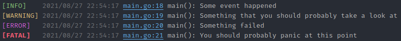
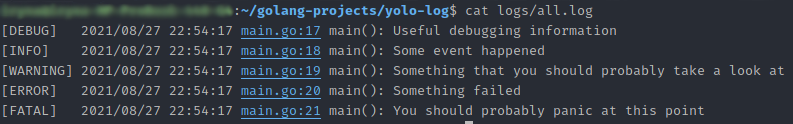

# You Only Log Once
 ... is a logger for Go (golang).

## Installation and Usage 
**Get the project:**

```
$ go get github.com/YRIDZE/yolo-log
```

**Use the project:**

```go
import "github.com/YRIDZE/yolo-log"
```

### Example
You can set logging level with a `LoggerParams` both for console and file outputs.

```go
package main

import (
	yolo "github.com/YRIDZE/yolo-log"
)

func main() {
	logger, err := yolo.NewLogger(yolo.LoggerParams{
		ConsoleOutputStream: os.Stdout,
		ConsoleLogLevel:     yolo.INFO,
		LogFileName:         "logs/all.log",
		FileLogLevel:        yolo.DEBUG,
	})
	if err != nil {
		panic(err)
	}
}
```

#### Logging severity level

Yolo has five logging levels: Debug, Info, Warning, Error and Fatal.

```go
logger.Debug("Useful debugging information")
logger.Info("Some event happened")
logger.Warning("Something that you should probably take a look at")
logger.Error("Something failed")
logger.Fatal("You should probably panic at this point")
```
Color-coded console output:


Plain file output:


#### Caveats
Path to the log file containing directory must exist even if the file itself does not exist. 
